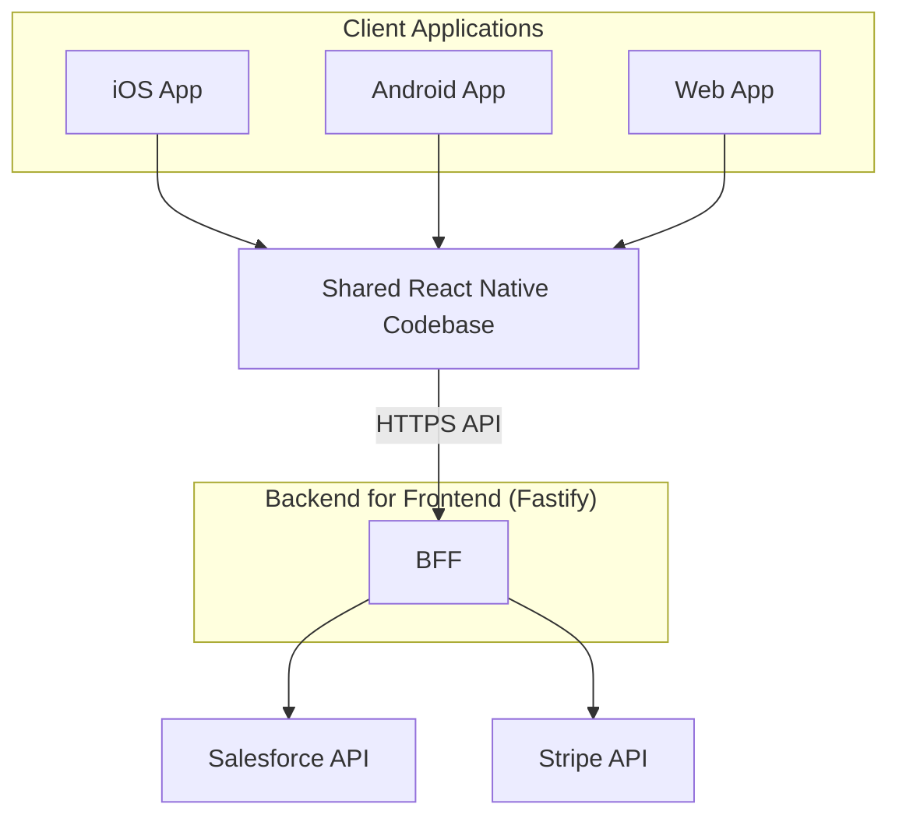
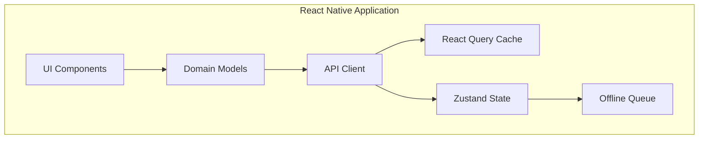
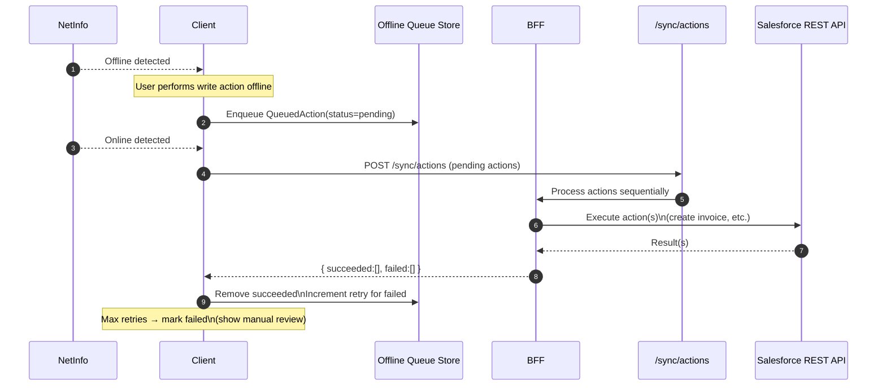
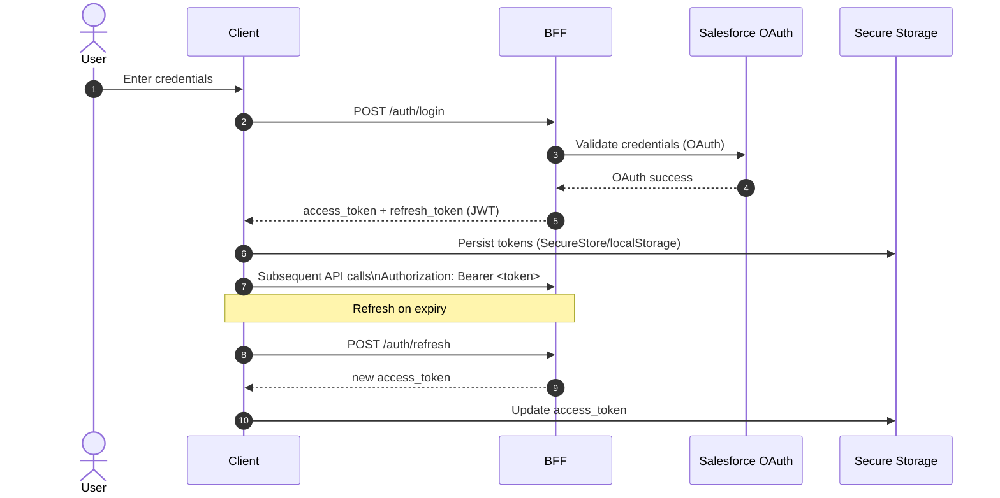
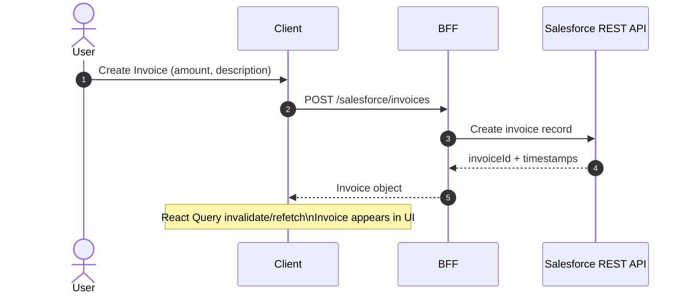
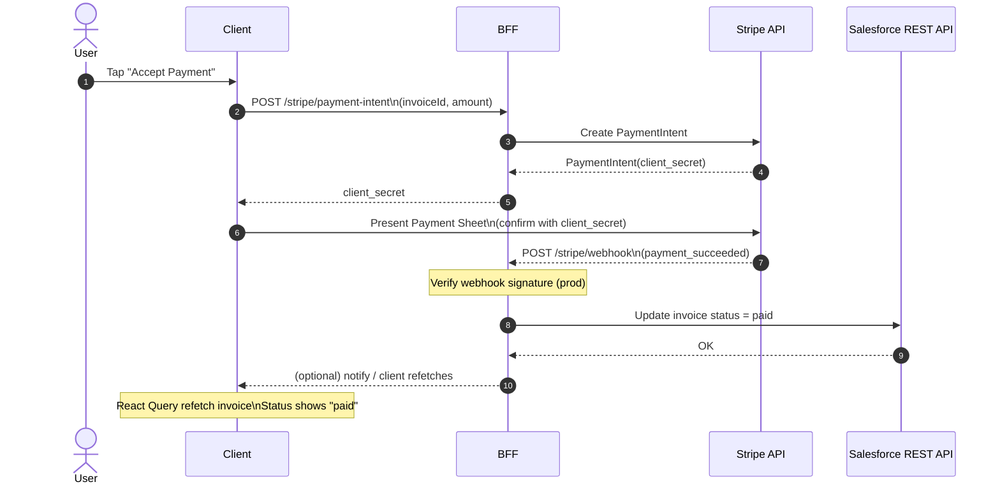
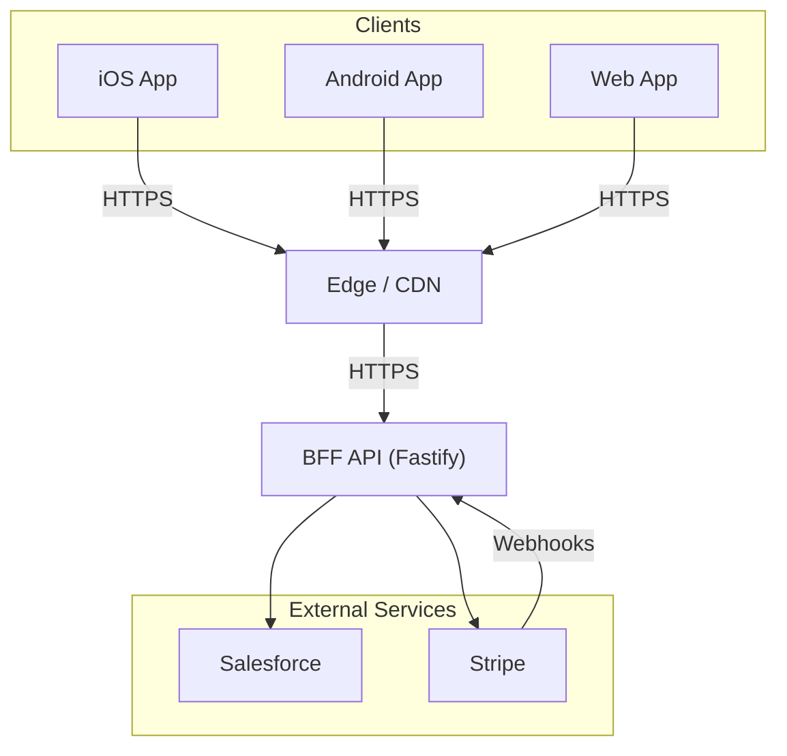

# Field Pay CRM — Architecture Documentation

## System Overview

Field Pay CRM is a cross-platform mobile application designed for field sales representatives who operate in environments with unreliable network connectivity. The system enables sales teams to:

- Browse customer accounts and contacts from Salesforce CRM
- Create invoices against customer accounts
- Collect payments using Stripe
- Continue working offline with automatic synchronization

This architecture document describes the system design, data flows, security model, and deployment considerations.

### Business Context

Field sales representatives frequently work in warehouses, industrial facilities, and rural areas where cellular connectivity is intermittent. The application must support offline operation for core workflows while maintaining data integrity when connectivity is restored.

### Technical Constraints

| Constraint | Implication |
|------------|-------------|
| Unreliable connectivity | Offline-first architecture with local queue |
| Cross-platform requirement | Single React Native codebase for iOS, Android, Web |
| Enterprise integrations | Salesforce CRM, Stripe payments |
| Security requirements | No secrets in mobile bundles; server-side credential management |

---

## System Architecture

### Layered Architecture Diagram





---

## Primary Workflows

### 1. Authentication Flow

1. User enters credentials on login screen
2. Client sends POST `/auth/login` to BFF
3. BFF validates credentials against Salesforce OAuth (or mock service)
4. BFF generates JWT access token and refresh token
5. BFF returns tokens to client
6. Client stores tokens in secure storage (expo-secure-store on native, localStorage on web)
7. Client attaches `Authorization: Bearer <token>` to all subsequent requests
8. On token expiration, client calls POST `/auth/refresh` to obtain new access token

### 2. Invoice Creation Flow

1. User navigates to account detail screen
2. User taps "Create Invoice" and enters amount and description
3. Client sends POST `/salesforce/invoices` with invoice data
4. BFF creates invoice record in Salesforce (or mock data store)
5. Salesforce returns invoice ID and created timestamp
6. BFF returns invoice object to client
7. Client updates local cache via React Query invalidation
8. Invoice appears in account's invoice list

### 3. Payment Processing Flow

1. User opens invoice detail screen for unpaid invoice
2. User taps "Accept Payment"
3. Client sends POST `/stripe/payment-intent` with invoice ID and amount
4. BFF creates PaymentIntent via Stripe API
5. Stripe returns PaymentIntent with `client_secret`
6. BFF returns `client_secret` to client
7. Client displays Stripe payment sheet (or simulated sheet in mock mode)
8. User completes payment entry
9. Stripe processes payment and sends webhook to BFF
10. BFF receives POST `/stripe/webhook` with payment confirmation
11. BFF updates invoice status to "paid" in Salesforce
12. Client receives confirmation and refreshes invoice data

### 4. Offline Synchronization Flow



1. Client detects network offline via NetInfo
2. User performs write operation (e.g., create invoice)
3. Client serializes action to `QueuedAction` object
4. Action stored in Zustand queue store with status "pending"
5. Client shows pending indicator in UI
6. Network connectivity restored
7. Sync service detects online transition
8. Sync service sends POST `/sync/actions` with all pending actions
9. BFF processes each action sequentially
10. BFF returns `{ succeeded: [...], failed: [...] }`
11. Client removes succeeded actions from queue
12. Client increments retry count for failed actions
13. Actions exceeding max retries marked as "failed" for manual review

---

## Monorepo Structure

```
/fieldpay-crm
├── apps/
│   └── mobile/              # Expo app (iOS, Android, Web)
├── packages/
│   ├── core/                # Domain models, utilities, constants
│   ├── ui/                  # Shared React Native components
│   └── api-client/          # Typed HTTP client for BFF
├── server/                  # Fastify BFF server
└── docs/                    # Architecture documentation
```

### Package Responsibilities

| Package | Purpose |
|---------|---------|
| `@fieldpay/core` | Framework-agnostic domain models, business logic, utilities |
| `@fieldpay/ui` | Cross-platform React Native UI components with design tokens |
| `@fieldpay/api-client` | Typed HTTP client with automatic auth header injection |
| `@fieldpay/server` | Backend For Frontend — proxies external APIs, owns secrets |
| `@fieldpay/mobile` | Expo application with screens, navigation, state management |

## Key Architectural Decisions

### 1. Backend For Frontend (BFF) Pattern

All external API communication flows through the BFF server. The client never directly communicates with Salesforce or Stripe.

**Benefits:**
- Secrets remain server-side (never in mobile bundles)
- Unified API surface for the client
- Request/response transformation
- Rate limiting and caching opportunities
- Simplified client logic

### 2. Offline-First Architecture

The application is designed to function without network connectivity.

**Components:**
- **Queue Store**: Zustand store holding pending actions
- **Sync Service**: Replays queued actions when connectivity returns
- **Network Monitor**: NetInfo subscription triggers sync on reconnection

**Flow:**
1. User performs action while offline
2. Action serialized to QueuedAction and stored locally
3. Network connectivity restored
4. Sync engine replays actions via `/sync/actions` endpoint
5. Successful actions removed; failed actions retry up to max attempts

### 3. State Management Strategy

| State Type | Solution | Rationale |
|------------|----------|-----------|
| Server State | React Query | Caching, background refetch, optimistic updates |
| Client State | Zustand | Lightweight, no boilerplate, easy persistence |
| Secure Storage | expo-secure-store | Platform-native secure storage for tokens |

### 4. Cross-Platform Code Sharing

Single Expo codebase serves iOS, Android, and Web:
- **UI Components**: React Native primitives work across platforms
- **Business Logic**: Pure TypeScript in `@fieldpay/core`
- **API Client**: Fetch-based, works everywhere
- **Navigation**: Expo Router with file-based routing

## Data Flow

### Authentication Flow



### Invoice Creation Flow



### Payment Flow



## Security Considerations

### Why Secrets Cannot Be Stored in Mobile Clients

Mobile applications present unique security challenges that require server-side credential management:

1. **Bundle inspection**: iOS and Android app bundles can be decompiled. Any secrets embedded in the bundle are extractable.

2. **Network interception**: Even with TLS, users can install proxy certificates to inspect their own traffic. Secrets sent to the client are visible.

3. **No secure rotation**: Secrets embedded in app bundles cannot be rotated without releasing a new app version and waiting for users to update.

4. **Compliance requirements**: PCI-DSS and SOC 2 require that payment credentials never be exposed to client applications.

The BFF pattern ensures all secrets remain server-side where they can be properly secured and rotated.

### Secrets Management

| Secret | Location | Exposure Risk |
|--------|----------|---------------|
| Salesforce Client Secret | Server `.env` | Never leaves server |
| Stripe Secret Key | Server `.env` | Never leaves server |
| JWT Signing Secret | Server `.env` | Never leaves server |
| Stripe Publishable Key | Client `.env` | Safe for client (by design) |

### OAuth Token Handling

1. **Token generation**: BFF generates JWT tokens after validating Salesforce OAuth credentials
2. **Token storage**: Client stores tokens in platform-secure storage
   - iOS/Android: `expo-secure-store` (Keychain / Keystore)
   - Web: `localStorage` (with appropriate XSS protections)
3. **Token transmission**: Always via HTTPS with `Authorization: Bearer` header
4. **Token validation**: Server validates signature and expiration on every request
5. **Token refresh**: Client proactively refreshes before expiration using refresh token

### Token Lifecycle

| Token Type | Lifetime | Storage | Refresh Strategy |
|------------|----------|---------|------------------|
| Access Token | 1 hour | Secure storage | Refresh 5 min before expiry |
| Refresh Token | 7 days | Secure storage | Re-authenticate on expiry |

### Stripe Webhook Verification

In production, Stripe webhooks must be verified to prevent spoofed payment confirmations:

1. Stripe signs each webhook payload with `STRIPE_WEBHOOK_SECRET`
2. BFF verifies signature using Stripe SDK before processing
3. Invalid signatures are rejected with 400 response
4. Webhook endpoint only accepts POST from Stripe IP ranges (optional additional security)

### TLS Requirements

| Connection | Minimum TLS | Certificate |
|------------|-------------|-------------|
| Client → BFF | TLS 1.2 | Valid CA-signed certificate |
| BFF → Salesforce | TLS 1.2 | Salesforce-managed |
| BFF → Stripe | TLS 1.2 | Stripe-managed |

All production deployments must enforce HTTPS. HTTP redirects to HTTPS are acceptable but direct HTTP access should be disabled.

---

## Observability

Observability is critical for enterprise mobile applications where issues may occur in the field without direct access to debugging tools.

### Structured Event Logging

All significant actions emit structured diagnostic events with consistent schema:

```typescript
interface DiagnosticEvent {
  id: string;           // Unique event identifier
  name: EventName;      // Standardized event name
  timestamp: string;    // ISO 8601 timestamp
  metadata?: Record<string, unknown>;  // Event-specific data
}
```

### Key Events Monitored

| Event | Trigger | Metadata |
|-------|---------|----------|
| `auth_success` | Successful login | `userId` |
| `auth_failure` | Failed login attempt | `error` |
| `auth_logout` | User logout | — |
| `invoice_created` | Invoice created | `invoiceId`, `amount` |
| `payment_intent_created` | PaymentIntent created | `paymentIntentId`, `amount` |
| `payment_success` | Payment confirmed | `invoiceId` |
| `payment_failure` | Payment failed | `error` |
| `sync_started` | Offline sync begins | `actionCount` |
| `sync_completed` | Offline sync finishes | `succeeded`, `failed` |
| `sync_failed` | Sync error | `error` |

### Client-Side Diagnostics Screen

The application includes a diagnostics screen accessible to users and support staff:

| Information | Purpose |
|-------------|---------|
| App version | Identify deployed version for support |
| Environment | Confirm dev/staging/production |
| Network state | Current connectivity status |
| Last sync time | When data was last synchronized |
| Queued actions | Number of pending offline actions |
| Recent events | Last 20 diagnostic events |

### Production Monitoring Considerations

For production deployments, events should be forwarded to a centralized logging service:

- **Recommended services**: Datadog, Sentry, LogRocket, or custom ELK stack
- **Event forwarding**: Batch events and send to `/telemetry` endpoint on BFF
- **Alerting**: Configure alerts for `payment_failure` and `sync_failed` events
- **Dashboards**: Track `invoice_created` and `payment_success` rates

## Environment Configuration

### Server

```env
NODE_ENV=development|staging|production
SALESFORCE_MODE=mock|live
STRIPE_MODE=mock|live
```

### Client

```env
EXPO_PUBLIC_API_URL=http://localhost:3001
EXPO_PUBLIC_STRIPE_PUBLISHABLE_KEY=pk_test_xxx
EXPO_PUBLIC_ENV=development|staging|production
```

## Mock Mode

The application runs fully functional without external API credentials:

- **Salesforce**: In-memory data store with realistic mock data
- **Stripe**: Simulated PaymentIntent creation and confirmation
- **Auth**: Demo credentials (demo@fieldpay.com / demo123)

Toggle via `SALESFORCE_MODE=mock` and `STRIPE_MODE=mock` environment variables.

---

## Deployment Architecture

### Deployment Diagram



### Environment Configuration

| Environment | Purpose | API Mode | Data |
|-------------|---------|----------|------|
| Development | Local development | Mock | In-memory mock data |
| Staging | Pre-production testing | Live | Salesforce sandbox, Stripe test mode |
| Production | Live users | Live | Salesforce production, Stripe live mode |

### Environment Variables by Stage

**Development:**
```env
NODE_ENV=development
SALESFORCE_MODE=mock
STRIPE_MODE=mock
```

**Staging:**
```env
NODE_ENV=staging
SALESFORCE_MODE=live
SALESFORCE_INSTANCE_URL=https://test.salesforce.com
STRIPE_MODE=live
STRIPE_SECRET_KEY=sk_test_xxx
```

**Production:**
```env
NODE_ENV=production
SALESFORCE_MODE=live
SALESFORCE_INSTANCE_URL=https://login.salesforce.com
STRIPE_MODE=live
STRIPE_SECRET_KEY=sk_live_xxx
```

### Recommended Hosting Platforms

| Component | Recommended Platforms |
|-----------|----------------------|
| BFF Server | Railway, Render, Fly.io, AWS ECS |
| Web App | Vercel, Netlify, Cloudflare Pages |
| iOS App | Apple App Store |
| Android App | Google Play Store |

### Infrastructure Considerations

1. **Horizontal scaling**: BFF is stateless and can scale horizontally behind a load balancer
2. **Database**: No database required for BFF (Salesforce is the system of record)
3. **Caching**: Consider Redis for session storage if scaling beyond single instance
4. **Secrets management**: Use platform-native secrets (Railway secrets, AWS Secrets Manager)

---

## Technology Stack

| Layer | Technology |
|-------|------------|
| Mobile/Web | React Native, Expo SDK 50, Expo Router |
| State | Zustand, React Query |
| UI | Custom components, React Native primitives |
| Backend | Node.js, Fastify, TypeScript |
| External | Salesforce REST API, Stripe API |
